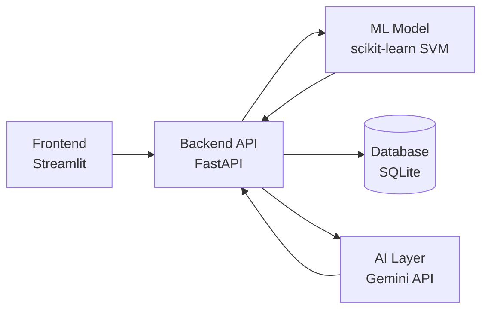

# 🩺 MediRec AI — Medicine Recommendation System

An ML + AI powered health assistant that predicts likely diseases from reported symptoms and generates a personalized, easy-to-understand explanation using a large language model.

## 🎯 What it does

1. User selects symptoms from a searchable list
2. A trained **SVM classifier** predicts the most likely disease
3. The system retrieves relevant precautions, medications, diet, and workout suggestions from a curated medical dataset
4. **Google Gemini** generates a warm, plain-language explanation of the prediction and recommendations
5. Every prediction is saved to a database, with a dashboard showing usage analytics and user feedback

## 🏗️ Architecture



- **Frontend**: Streamlit — symptom checker, prediction history, analytics dashboard
- **Backend**: FastAPI — REST API with automatic interactive docs (`/docs`)
- **ML**: scikit-learn SVM classifier trained on symptom-disease mapping data
- **AI**: Google Gemini API generates patient-friendly explanations, with graceful fallback if unavailable
- **Database**: SQLite + SQLAlchemy ORM — stores every prediction and user feedback
- **Testing**: pytest test suite covering all API endpoints

## 📁 Project Structure

```
Medicine-Recommendation-System/
├── backend/
│   ├── main.py          # FastAPI app and routes
│   ├── ml_service.py    # ML prediction logic
│   ├── ai_service.py    # Gemini AI integration
│   ├── database.py      # DB connection setup
│   ├── models.py        # SQLAlchemy table definitions
│   └── schemas.py       # Request/response validation
├── frontend/
│   └── app.py            # Streamlit UI
├── .streamlit/
│   └── config.toml       # Theme configuration
├── Datasets/              # Symptom, disease, medication, diet data
├── ml_models/             # Trained SVM model
├── tests/
│   └── test_api.py       # API test suite
└── requirements.txt
```

## 🚀 Running Locally

**1. Clone and set up environment**

```bash
git clone https://github.com/Divyani-Mali/Medicine-Recommendation-System.git
cd Medicine-Recommendation-System
python -m venv venv
venv\Scripts\activate      # Windows
pip install -r requirements.txt
```

**2. Add your Gemini API key**

Create a `.env` file in the project root:

GEMINI_API_KEY=your_key_here

(Get a free key at [Google AI Studio](https://aistudio.google.com/app/apikey))

**3. Run the backend**

```bash
uvicorn backend.main:app --reload
```

API docs available at `http://127.0.0.1:8000/docs`

**4. Run the frontend** (in a separate terminal)

```bash
streamlit run frontend/app.py
```

App available at `http://localhost:8501`

## 🔌 API Endpoints

| Method | Endpoint    | Description                                             |
| ------ | ----------- | ------------------------------------------------------- |
| GET    | `/symptoms` | List all valid symptoms                                 |
| POST   | `/predict`  | Predict disease from symptoms, get full recommendations |
| GET    | `/history`  | Recent prediction history                               |
| POST   | `/feedback` | Submit feedback on a prediction                         |
| GET    | `/stats`    | Aggregated analytics (total predictions, top diseases)  |

## 🧪 Running Tests

```bash
pytest tests/ -v
```

## 🔮 Future Improvements

- Retrain SVM model with a larger, more diverse symptom dataset
- Add user authentication for personalized history
- Deploy to cloud (Render/Railway for backend, Streamlit Cloud for frontend)
